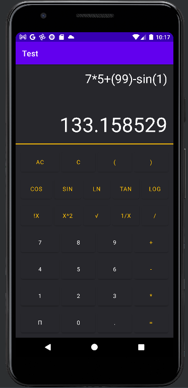
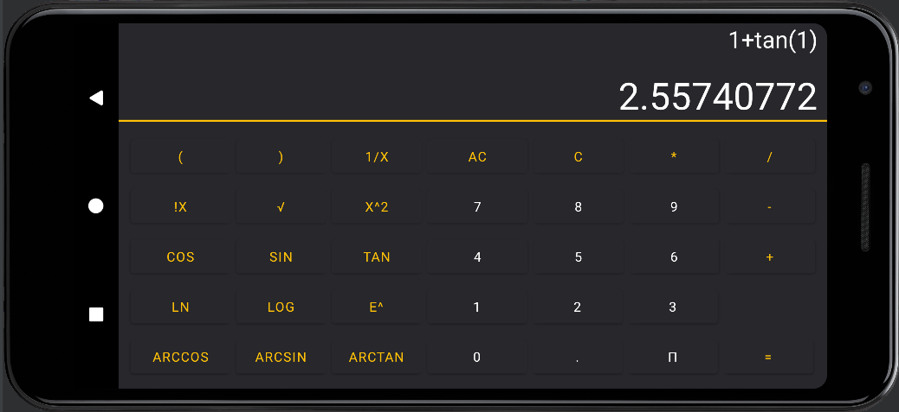

# calculator_android
> A small application which using native android that allow users to perform arithmetic operation

Currently in Development.

 <h1 align="center">
   
 
   
  portrait interface
</h1>

 <h1 align="center">
   
 
   
  Landscope interface
</h1>

## functional need
- [x] +/-/* operation
- [x] quotient operation
- [x] Tangente
- [x] consinus 
- [x] sinus
- [x] logarithmic
- [x] power
- [x] Square root
- [x] factorial
- [x] arcsin
- [x] arccos
- [x] arctan
- [x] expo

